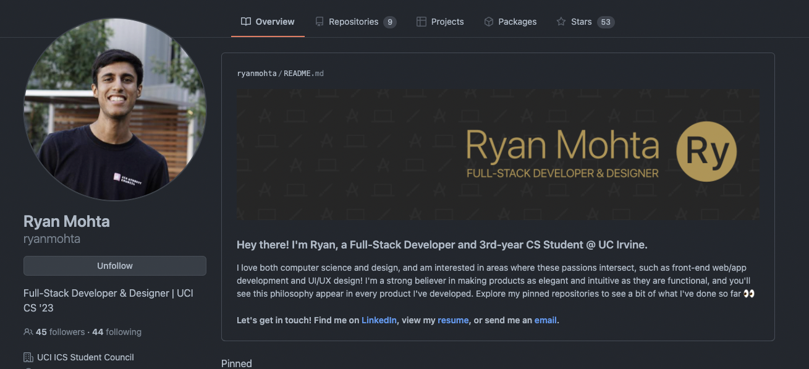

import Video from '@site/src/components/Video';

# Unit 1: Git-ing GitHub Setup

## Welcome to Unit 1 👋

This week we are going to briefly cover GitHub, READMEs, Markdown, and GitHub Profiles. This is a shorter unit to get the Fellowship started. You may even already be familiar with some of these concepts. 

## Unit 1 Lecture Video

<Video url="https://www.youtube.com/embed/bJKevRR554o" />

## GitHub

[GitHub](https://github.com) is a website for you to backup your code. It makes it easy for you to collaborate on projects with others. You should treat it like a portfolio for your work as a software developer.

Create an account at [https://github.com/signup](https://github.com/signup)  
*Note: Since you will have this for a long time, use your personal email, not your school email.*

## README.md

Every project you make should have a README. The README is the first thing that people will see when they look at your project on GitHub; it’s your opportunity to make a good impression!

Project READMEs should usually have the following:

- Project description
- Screenshots or gifs of the project in action
- How someone can get started with the project
- Who has built/contributed to the project

READMEs are written in a language called **Markdown**.

## Markdown

Markdown is a markup language to add formatting elements to your text.  The `.md` file extension indicates that the file is written in Markdown.

### Headings

Headings are the titles of your sections. To create a heading, add one to six `#` symbols before the text. The more `#` symbols you use, the less important that heading is.

### Text Formatting

We can also do some text formatting, just like in Word.

| Plaintext | Markdown |
| --- | --- |
| \*\*Bold\*\* | **Bold** |
| \*Italic\* | *Italic* |
| \*\*\*Bold and Italic\*\*\* | ***Bold and Italic*** |
| \~Strikethrough\~ | ~~Strikethrough~~ |
| \`code\` | `code` |
| \[Link\](htttps://studentcouncil.ics.uci.edu) | [Link](htttps://studentcouncil.ics.uci.edu) |
| - List Item 1 - List Item 2 - List Item 3 | • List Item 1 • List Item 2 • List Item 3 |

### Newlines

Newlines are often the trickiest for markdown beginners. 

To create a newline, you have two options:

- Add 2 spaces to the end of the previous line
- Add an extra newline

| Text | Markdown |
| --- | --- |
| `This is a line.` `But it doesn’t have 2 spaces on the end.` | `This is a line. But it doesn't have two 2 on the end.` |
| <code>This line DOES have 2 spaces. &nbsp;&nbsp;</code> `So it’s on a newline!` | `This line DOES have 2 spaces.` `So it’s on a newline!` |
| `This has an extra newline` `‎`  `So it works too!` | `This has an extra newline`  `So it works too!` |

### Images

You can also include images in a README! There’s a few ways to do this:

- Reference the URL of an image ``
- Reference a file in your folder ``
- Or just copy+paste a picture in the GitHub text editor in your browser!

### + More!

There’s WAY more that you can do with Markdown. Take a minute to look through [GitHub’s Markdown Guide](https://docs.github.com/en/github/writing-on-github/getting-started-with-writing-and-formatting-on-github/basic-writing-and-formatting-syntax) and checkout all the cool things you can do with Markdown!

Can you figure out how to add quotes or multiline code?

## GitHub Profile README

Did you know that GitHub profiles can have a README too? This is a special hidden feature on GitHub that will help set you apart from other accounts!

To create a GitHub Profile README, you just need to create a repository with the same name as your username and add a README.md file to that repo.

Some people get really fancy with these. Here are a few [Awesome GitHub Profile README Examples](https://abhisheknaiidu.github.io/awesome-github-profile-readme/).  

## Assignment

Your assignment this week is to create a [GitHub account](https://github.com/signup) and add a GitHub Profile README. 
Already have one? Great! You can relax this week or continue to improve it.

Here’s a guide on [creating your GitHub profile README](https://docs.github.com/en/account-and-profile/setting-up-and-managing-your-github-profile/customizing-your-profile/managing-your-profile-readme). 

### Deliverables

**Required Tasks**

<ul>
    <li>Create a GitHub Account</li>
    <li>
        Create a Profile README with:
        <ul>
            <li>A header</li>
            <li>At least 300 characters</li>
            <li>At least one instance of Bold or Italics text</li>
            <li>At least one external link</li>
        </ul>
    </li>
</ul>

**Optional** **Stretch Goals**

<ul>
    <li>Add a name, description, and profile picture to your GitHub account</li>
    <li>Add an image in your Profile README</li>
</ul>

### Due Date

Monday, April 11 by 11:59pm

### Submission

Complete the [Google Form](https://forms.gle/ve16FzUfq57HsyUi6). Please use your UCI email. 

<iframe src="https://docs.google.com/forms/d/e/1FAIpQLSf0A1aXDnppcJQnmMDrDAKw4WZyq2ot8JS5mOFGGnl0hU0ncg/viewform?embedded=true" width="100%" height="1500" frameborder="0" marginheight="0" marginwidth="0">Loading…</iframe>

## External Resources

- README
    - [About READMEs](https://docs.github.com/en/repositories/managing-your-repositorys-settings-and-features/customizing-your-repository/about-readmes)
- Markdown
    - [Markdown Guide Cheatsheet](https://www.markdownguide.org/cheat-sheet/)
    - [GitHub’s Markdown Guide](https://docs.github.com/en/github/writing-on-github/getting-started-with-writing-and-formatting-on-github/basic-writing-and-formatting-syntax)
- GitHub Profile README
    - [Creating your profile README Guide](https://docs.github.com/en/account-and-profile/setting-up-and-managing-your-github-profile/customizing-your-profile/managing-your-profile-readme)
    - [Awesome GitHub Profile README Examples](https://abhisheknaiidu.github.io/awesome-github-profile-readme/)