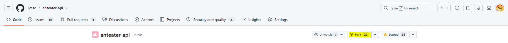
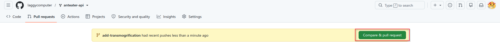
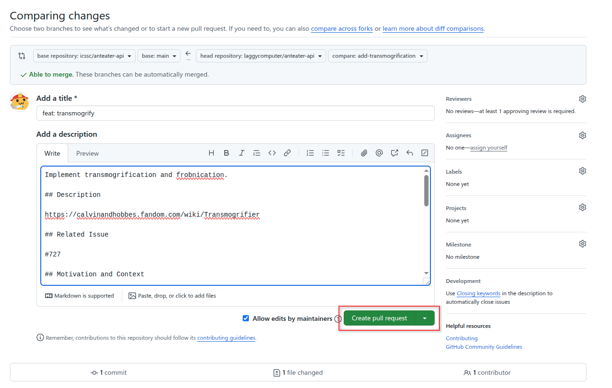

import Video from '@site/src/components/Video';

# Unit 10: Open Source Contribution

## Welcome to the Final Unit!
In your final unit, you'll use the skills learned throughout the fellowship to make an Open Source Contribution on one of our ICSSC Projects. 

## Unit 10 Lecture Video
<Video src="https://www.youtube.com/embed/jk3LCtFAb9Y" />

:::caution Recent Changes
A few important changes have been made since this video was created:
- The `fellowship` tag has been replaced with the `good first task` tag.
- The ICSSC Github Organization was renamed from "ICSSC Projects" to just "ICSSC".  
- Also, some of the AntAlmanac code seen in the video may look different from the current state of the project.
:::

## What is Open Source?
Open source software projects have their source code completely available for anyone to use and improve.
Most open source projects have their code on GitHub.
This makes it extremely easy for people to contribute to them. 

:::note Fun Fact
ICSSC projects are all open sourced. Over 100 students have contributed to the projects!
:::

## Making an Open Source Contribution

1. **Fork a project**



2. **Clone your forked project**

See the [GitHub docs](https://docs.github.com/en/repositories/creating-and-managing-repositories/cloning-a-repository#cloning-a-repository).
You may need to [add a personal access token](https://docs.github.com/en/repositories/creating-and-managing-repositories/troubleshooting-cloning-errors#provide-an-access-token) to get push permissions.

3. **Make and commit changes**
```bash
git add <files>
git commit -m "Message"
```

4. **Push your changes to your forked project**
```bash
git push
```

5. **Open a pull request**






6. **Complete the Review Process**
Now you wait for your changes to be approved by a project maintainer. 

They might request additional changes before they approve your code and merge it into the project.
Making changes to an existing pull request is super easy.
From your computer, you simply commit the new changes and push.
The pull request should be automatically updated.

## Assignment

Your final task for the Fellowship will be to make a contribution to one of the [ICSSC Projects](https://github.com/icssc)!
We've set aside some simple issues with the `good first task` tag for y'all to work on.

- [AntAlmanac Issues](https://github.com/icssc/AntAlmanac/issues?q=is%3Aissue+is%3Aopen+label%3A"good+first+task")
- [Anteater API Issues](https://github.com/icssc/anteater-api/issues?q=is%3Aissue+is%3Aopen+label%3A"good+first+task")
- [PeterPlate Issues](https://github.com/icssc/peterplate/issues?q=is%3Aissue+is%3Aopen+label%3A"good+first+issue")
- [ZotMeet Issues](https://github.com/icssc/ZotMeet/issues?q=is%3Aissue+is%3Aopen+label%3A"good+first+issue")
- [Fellowship Website Issues](https://github.com/icssc/fellowship/issues?q=is%3Aissue+is%3Aopen+label%3A"good+first+task")

Once you've found an issue that you like, leave a comment on it to claim the task.
You are only allowed to do one issue with the `good first task` tag because we want to make sure there are enough tasks for everyone.

However you are not limited to just these issues.
If you'd rather try a harder issue or if have your own idea for how to improve a project, feel free to do so!
You can work on as many other issues as you like.

If you have any questions about the projects, ask in the project Discord channels!

**Required Tasks**

- Open a Pull Request
- Complete the Feedback Survey

### Submission

Complete the [Google Form](https://forms.gle/RaeJHkNc6DHRMoqz7).

The first page of this Google Form is for the Capstone Assignment.
The second page is the Feedback Survey for the Fellowship. 

<iframe src="https://docs.google.com/forms/d/e/1FAIpQLSeY6XyW_I0Cl2dsnrLlC-aR9XvPBamFoZ8KupOt0eFsUN144g/viewform" width="100%" height="1056" frameborder="0" marginheight="0" marginwidth="0">Loading…</iframe>

### External Resources

- [Git With The Flow](https://www.notion.so/Git-With-The-Flow-20cf67a557ec492c9b801396b27a51cf)
- [ICSSC contributor docs](https://docs.icssc.club/docs/contributor/)
- [https://www.dataschool.io/how-to-contribute-on-github/](https://www.dataschool.io/how-to-contribute-on-github/)
- [How to Open Source Like a Pro - Ben Awad](https://www.youtube.com/watch?v=MT6M_sqAuZo) (parody)
- Friendly Open Source Projects for beginners: [https://www.firsttimersonly.com/](https://www.firsttimersonly.com/)
