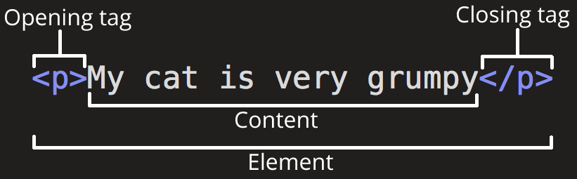
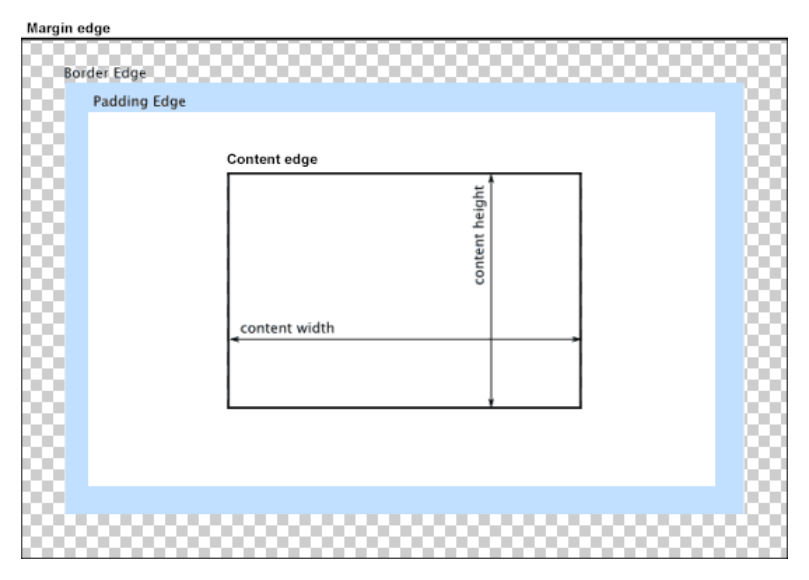
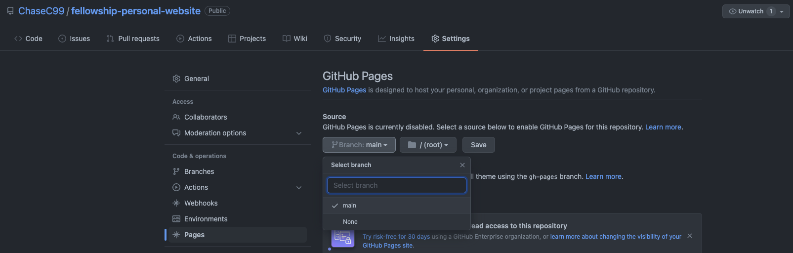

import Video from '@site/src/components/Video';

# Unit 4: Intro to Web Dev

## Welcome to Unit 4 🌐
It's finally time to start learning about web development! 
This week we'll get started on your personal website and cover the basics of HTML and CSS.

## Unit 4 Lecture Video

<Video src="https://www.youtube.com/embed/45teq99E4DA" />

### Fireship Videos
Take 200 seconds to check out these videos from Fireship for an even a better understanding of HTML and CSS.
<Video src="https://www.youtube.com/embed/ok-plXXHlWw" />
<Video src="https://www.youtube.com/embed/OEV8gMkCHXQ" />

## VS Code
Before we get started developing websites, we need somewhere to write our code!
**Visual Studio Code** is a very popular text editor used for all types of development. With many different extensions and lots of customizable settings, it's very flexible. 

### VS Code Download
You can download VS Code from the offical website: https://code.visualstudio.com/

### Code Terminal Command
One small cool feature is that in your terminal, you can add the `code` command, so that if you type `code <some directory or file>`, it will open up the file/directory in VS Code! 

- For Windows and Linux, this should be automatically installed.
- For Mac, to get `code` added to your terminal, just follow these [three steps](https://code.visualstudio.com/docs/setup/mac#_launching-from-the-command-line).

## HTML (HyperText Markup Language)

HTML is not a programming language; it is a **markup** language. It tells web browsers how to structure the web pages that you visit.  HTML consists of a series of elements, which can contain such as a text, image, or any other content. Each element is enclosed by tags that can specify unique attributes of the content.



Here are some common tags that you might use:

```html
<h1> Heading level 1 </h1>
<h2> Heading level 2 </h2>
<p> A paragraph of text </p>
<!-- a comment that does not get written into your web page -->
 <!-- an image -->
<ul> <!-- an unordered list with bullet points -->
	<li> list item 1 </li>
	<li> list item 2 </li>
</ul>  
<strong> **Important content that is bolded** </strong>
<em> *Emphasized content that is italicized* </em>
<div> A division or section of content </div>
```

Note that some elements like `` have a self-closing tag. How does it know what the content is? More on that later...

### Nesting

Elements can be placed as the content of other elements.
```html
<div>
	<p>I <strong>love</strong> HTML!</p>
</div>
```

The following is an example of the ***wrong*** way to do nesting:

```html
<p>The WRONG way to do <strong>nesting.</p></strong> <!-- Don't do this -->
```

The **tags have to open and close in a way that they are inside or outside one another**. With the kind of overlap in the example above, the browser would be unsure what your intentions are.

### Attributes

Elements can also have **attributes**. The attributes of an element contain extra information that doesn't appear in the content. 


Attributes specify options and add meaning. They are space-separated lists of names and values. (Kind of like variables.)

```html
<div attributeA="valueA" attributeB="valueB">
	Content goes here
</div>
<a href="https://facebook.com">Facebook</a>
```

Getting back to the `` tag, it uses attributes to know what content to display. 

```html

```

Every tag can have a `class` and `id` attribute. They are just like any attribute, but they are often used to identify specific tags in CSS and JavaScript.

```html
<div class="widget foo" id="baz"></div>
```

Some things to consider about the `class` and `id` attribute: 

- They are just like any other attribute (href, src).
- An element can have many classes, only one ID.
- Each page can have only one element with a given ID.
- Can use the same class on multiple elements.
    - It's useful to apply the same style to many elements.

🧠 Pro Tip: IDs can be used for navigation (i.e.: <a href="https://marsc.dev/#experience" target="_blank">https://marsc.dev/#experience</a> will take you directly to the experience section.)

### A full HTML document

```html
<!DOCTYPE html>
<html>
  <head>
	<!--- The `head` is for meta data, and importing styles/scripts --->
    <title>My test page</title>
    <meta charset="utf-8">
	<link rel="stylesheet" href="style.css">
  </head>

  <body>
	<!--- The `body` is where the content of your website goes --->
    <p>This is my page</p>
  </body>
</html>
```

### HTML Reference

There are hundreds of tags, each with different default behaviors, that you can check out on [W3 Schools' HTML Element Reference page](https://www.w3schools.com/tags/).

## CSS (Cascading Style Sheets)

CSS is a stylesheet language used to describe the presentation of a document that is written in HTML. Unlike HTML which provides the structure for the document, CSS provides the styling and how the document is presented. 

### CSS syntax

- Selectors specify which elements a rule applies to.
- Rules specify what values to assign to different formatting properties.

```css
selector {
	property: value;
	property: value;
	...
}
```

In this case, we select all HTML elements with the `p` tag. These elements will use the font 'Arial', and be colored red.

```css
p {
	font-family: 'Arial';
	color: red;
}
```

There are three main ways of selecting HTML to style: Element, ID, and Class. Remember, ID and class can be set as attributes for each element. There are also more, base don attribute, or pseudo-classes. 

```css
p { /* Select by element tag */
	font-family: 'Arial';
	color: red;
}
.emphasize { /* Select by element class */
	font-family: 'Arial';
	color: red;
}

#redtext { /* Select by element id */
	font-family: 'Arial';
	color: red;
}

img[src] { /* Select img with src attribute */
	width: 500px;
}

a:hover { /* When 'a' tags are hovered by your mouse they become blue */
	color: blue
}
```

### CSS Reference

Mozilla has a full list of supported properties on their [CSS Reference Guide](https://developer.mozilla.org/en-US/docs/Web/CSS/Reference#index).

### Specifying Styles

The best practice way of specifying styles is to create a separate `<name>.css` file, where you will put all your styles and rules. 

```html
<head>
	 <!-- Use the './css/style.css' file for styling this document -->
	<link rel="stylesheet" href="./css/style.css">
</head>
<body>
	...
</body>
```

### The Box Model 🔲

CSS is all about boxes, in how the entire page is laid out. Each box has multiple properties in how they take up space: 

- `padding` - the space around the content. In the example below, it is the space around the paragraph text.
- `border` - the solid line that is just outside the padding.
- `margin` - the space around the outside of the border. This is used to separate elements from its neighbors
- `width` - the width of the content
- `height` - the height of the content

Padding, border and margin have direction properties. (e.g., padding-top,
margin-right, border-left). 

Borders can have a `border-color`, `border-width`, and `border-style`.



### Units

For the above properties, they all can be set with certain units. 

| Unit | Description |
| --- | --- |
| Pixels (px) | 1 pixel |
| Element units (em) | Relative to the font-size of the element.  |
| Percentages (%) | Relative to the parent element. |
| Real-world units (in, cm) | An inch, or centimeter. Not recommended to use. |
| Viewport (vh, vw) | Relative to 1% of the width/height of the viewport, or display. (100vh = 100% of the height of the viewport. |
- Try to use relative units (em and %) whenever possible. Helps for accessibility, when users change default sizes.
- Don't use real-world units, as these are fixed regardless of device.

### Display

The [display property](https://css-tricks.com/almanac/properties/d/display/) is one of the most important CSS properties for controlling layout. Let's take a look at a few of the more common ones.

- `inline` - Does not start on a newline and only takes up as much width as necessary.
    - Examples of inline-level elements: `<span>`, `<a>`, ``
- `block` - Always starts on a new line and takes up the full width available.
    - Examples of block-level elements: `<div>`, `<p>`, `<h1>` - `<h6>`
- `none` - Hides the content.
- `flex` - An efficient way to lay out, align, and distribute space among items in a container.
	- Understanding flex is critical if 

### Flexbox
The `flex` display property is so important, that we are giving it its own section.  
Take 1 minute to glace over the [Flexbox Properties Guide](https://css-tricks.com/snippets/css/a-guide-to-flexbox/#aa-flexbox-properties) on this CSS Tricks page.

Imagine we have a div with 3 items in it. 
```html
<div class="container">
	<div>Item 1</div>
	<div>Item 2</div>
	<div>Item 3</div>
</div>
```
How would we arrange these items into a row that is centered in the middle of the div?
We can use flexbox!
```css
.container {
	/* Give the container a display of flex */
	display: flex;

	/* Set the direction to be row */
	flex-direction: row;

	/* Center the content in the middle */
	justify-content: center;	/* horizontally centered */
	align-items: center;		/* vertically centered */
}
```

Flexbox has a lot of powerful options. Here are a few from the [Flexbox Properties Guide](https://css-tricks.com/snippets/css/a-guide-to-flexbox/#aa-flexbox-properties) linked above.

| Rows and Columns | Horizontal Alignment | Vertical Alignment |
| --- | --- | --- |
| flex-direction | justify-content | align-items | 
| [](https://css-tricks.com/snippets/css/a-guide-to-flexbox/#aa-flex-direction) | [](https://css-tricks.com/snippets/css/a-guide-to-flexbox/#aa-justify-content)| [](https://css-tricks.com/snippets/css/a-guide-to-flexbox/#aa-align-items) |

Fireship has another great video explaining Flexbox and how to size and align the child elements.
<Video src="https://www.youtube.com/embed/K74l26pE4YA" />

## GitHub Pages

Alright so now that you have the beginning of an awesome website, how do you share it with the world? 
We need somewhere to host the website. 
**GitHub Pages allows us to deploy our site quickly, easily, and for free**.

To activate GitHub pages for your repository:
1. Click on the “Settings” tab
2. Click “Pages”
3. Select “main” as your Source Branch
4. Click “Save”
5. Check “Enforce HTTPS”



Now, whenever you push a new commit to the `main` branch of your repository, the website will be **automatically updated**.

## Assignment

This week, we are going to start development on your very own personal website and get it deployed with GitHub Pages! The requirements to complete the assignment are fairly simple but try your best to make your site look good :)

**Required Tasks**

- Deploy your website to GitHub Pages
- Add the following to your `index.html` file
    - A `<head>` with:
        - `<title>`
        - `<link>` to your `styles.css` stylesheet
    - A `<body>` with ***at least*** each of the following tags
        - `h1`, `h2`, `p`, `a`, `img`, `ul`, `li`, `div`
        - An element that has a `class` attribute
        - An element that has an `id` attribute
- Create a `styles.css` file
    - Add color somewhere on your site
    - Modify the style of elements that have a `class` attribute
    - Modify the style of an element that has an `id`
- Use flexbox somewhere on your website

**Optional Stretch Goals**

- Add an icon to your website (should show up in your browser's tab)
- Add a media query

### Due Date

April 25nd at 11:59pm

### Submission

Complete the [Google Form](https://forms.gle/ywE4xEBNrMZXJ3Br7).

<iframe src="https://docs.google.com/forms/d/e/1FAIpQLSfu_GStSWec4__C2v9W6SwtzWuLtWYPJX3nPW25IPOlPaK3iQ/viewform?embedded=true" width="100%" height="1300" frameborder="0" marginheight="0" marginwidth="0">Loading…</iframe>

## External Resources

Practice
- Khan Academy Intro to HTML/CSS: https://www.khanacademy.org/computing/computer-programming/html-css

HTML
- W3 Schools HTML Tutorial: https://www.w3schools.com/html/default.asp

CSS
- W3 Schools CSS Tutorial: https://www.w3schools.com/css/default.asp
- CSS Tricks Almanac: https://css-tricks.com/almanac
- Fireship CSS Pro Tips Video: https://www.youtube.com/watch?v=Qhaz36TZG5Y

Flexbox
- CSS Tricks Flexbox Guide: https://css-tricks.com/snippets/css/a-guide-to-flexbox/
- Fireship Flexbox in 100 seconds: https://youtu.be/K74l26pE4YA
- Kevin Powell's Flexbox Fundamentals: https://youtu.be/u044iM9xsWU