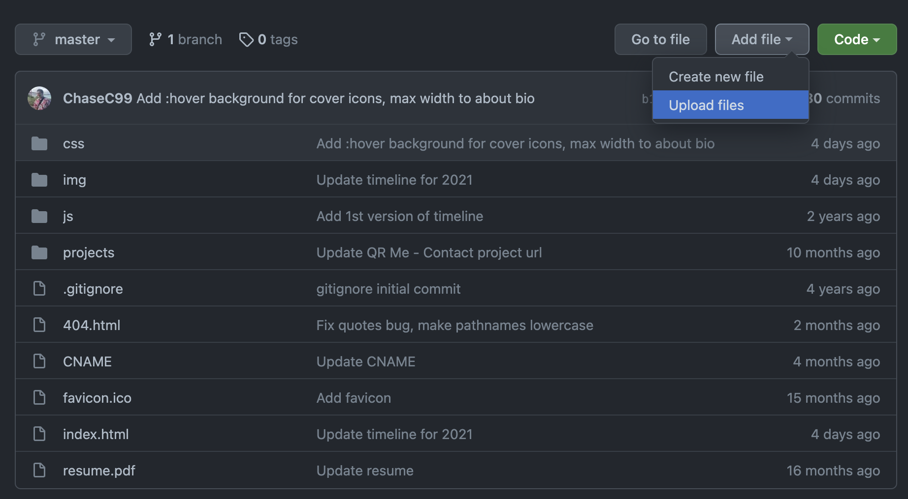
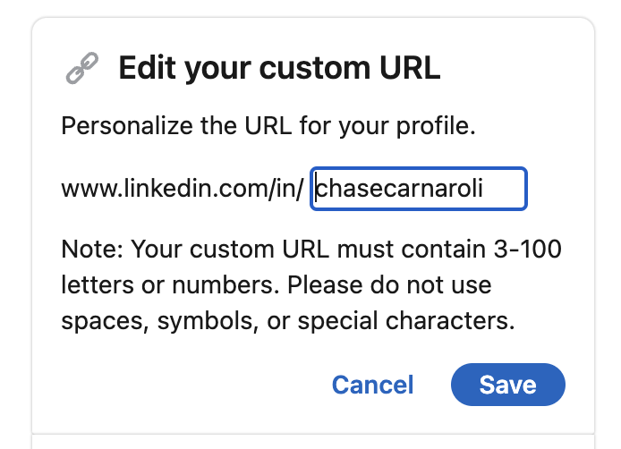

import Video from '@site/src/components/Video';

# Unit 5: Personal Branding

## Welcome to Unit 5

This unit we take a quick detour to discuss personal branding! When it comes to your career, professional development is just as important as software development.

## Unit 5 Lecture Video

<Video src="https://www.youtube.com/embed/O-2x0eAMPss" />

## Resume

### Parts of your Resume

Your resume should have the following parts:

- Header
    - Contact Info: Name, Phone, Non-UCI email
    - Links: LinkedIn, GitHub, Website
    - [Optional] City, State (not as relevant since most tech roles offer relocation)
- Education
    - “University of California, Irvine”
    - Graduation date (e.g. June 2024)
    - Major and Minor
    - GPA if above a 3.0
- Work Experience and/or Leadership Experience
    - Position
    - Date range of involvement (e.g. June 2021-September 2021)
    - Position and description of accomplishments
- Projects
    - Languages/frameworks used
    - Short description
    - Link to Github or website (if possible)

### Do's and Don'ts

<div style={{display: "flex", flexDirection: "row", justifyContent: "space-between", flexWrap: "wrap"}}>
  <div>
    Your resume <b>should</b> include:
    <ul>
      <li>Name</li>
      <li>Phone and non-edu email</li>
      <li>LinkedIn, GitHub, Website</li>
      <li>
          Education
          <ul>
            <li>“University of California, Irvine”</li>
            <li>Major</li>
            <li>Graduation date</li>
            <li>[Optional] GPA if above a 3.0</li>
          </ul>
      </li>
      <li>Work Experience</li>
      <li>Personal Projects</li>
      <li>Leadership Experience</li>
      <li>[Optional] Skills</li>
      <li>[Optional] Relevant coursework</li>
    </ul>
  </div>
  <div>
    Your resume should <b>NOT</b> include:
    <ul>
      <li>Profile picture</li>
      <li>Protected categories (race, gender, sexuality, etc.)</li>
      <li>Objective or Biography</li>
      <li>Unrelated hobbies</li>
      <li>2 column format</li>
      <li>Excessive design elements</li>
      <li>Random skill metric</li>
    </ul>
  </div>
</div>


### Tips

<div style={{display: "flex", flexDirection: "row", justifyContent: "space-between", flexWrap: "wrap"}}>
  <div>
    Content Tips
    <ul>
      <li>
        Use bullet points, not paragraphs
        <ul>
          <li>Get to the point</li>
        </ul>
      </li>
      <li>
        Use the <a href="https://www.inc.com/bill-murphy-jr/google-recruiters-say-these-5-resume-tips-including-x-y-z-formula-will-improve-your-odds-of-getting-hired-at-google.html" target="_blank">XYZ Formula</a>
        <ul>
          <li>Accomplished [X], as measured by [Y], by doing Z</li>
        </ul>
      </li>
      <li>Add lots of stats/numbers. Recruiters love stats!</li>
      <li>Cater to your audience</li>
      <li>Check for grammar</li>
    </ul>
  </div>
  <div>
    Design Tips
    <ul>
      <li>1 page, single column</li>
      <li>Clean, simple, and consistent</li>
      <li>Use the same font/font sizes</li>
      <li>Save as PDF</li>
      <li>Balance between text and white space</li>
      <li>You can make the margins smaller if you need more room</li>
    </ul>
  </div>
</div>

### Adding your Resume to your website

Now that you have a resume, let's add it to your website!  
First, export your resume as a `.pdf` file. 
There are two ways to add this `.pdf` file to your website:

**[Option 1]** You can either commit it to your project and push
```bash
mv <path to resume> chasec99.github.io/resume.pdf
cd chasec99.github.io
git add resume.pdf
git commit -m "Add resume"
```

OR

**[Option 2]** Go to your repo's GitHub page and upload the resume.pdf file


### Redirecting from GitHub's 404 page

You can access your resume by going to `username.github.io/resume.pdf`. 

But what happens if someone goes to `username.github.io/resume` without `.pdf` on the end? You'll get a 404 error!
This is because GitHub doesn't know where to send the user when they don't include the file extension. 

However, we can provide our own 404 page and have it immediately redirect to the desired location. 
The idea is this:

- User goes to `username.github.io/resume`
- GitHub returns `username.github.io/404.html`
- The 404.html page sees that the user attempted to go to `resume` and immediately redirects to `username.github.io/resume.pdf`

This all happens so fast, that the user will never actually see the 404 page.

Add your own `404.html` file to your project. 
Inside of the head add a `<script>` tag with code similar to the one below. 
The code inside of the `<script>` tag gets executed on page load.

```html
<!DOCTYPE html>
<html>
  <head>
    <meta charset="utf-8">
    <!-- TODO: Replace title with your website's name-->
    <title>Chase Carnaroli</title>
    <script type="text/javascript">
      // Dictionary that has all of your redirect rules
      // You can add additional redirects if you'd like
      // e.g. /resume -> /resume.pdf
      const redirects = {
        "resume": "resume.pdf"
      }

      // window.location.pathname -> Get the path -> /resume
      // .substring(1) -> remove the first character -> resume
      // .toLowerCase() -> make sure the path name is all lowercase       
      const path = window.location.pathname.substring(1).toLowerCase();

      const redirect = redirects[path];
      if (redirect) {
        // Redirect to the desired location
        window.location.replace(redirect);
      } else {
        // If the path doesn't exist, you can redirect to your main page
        // or you can remove this line of code if you just want to show the 404 page.
        window.location.replace("https://www.chasecarnaroli.com"); // TODO: add your website
      }
    </script>
  </head>
  <body>
    <h1>404 Not Found</h1>
  </body>
</html>
```

## LinkedIn

LinkedIn is a profession networking site that can help you land internships and full time roles. Sign up at [https://www.linkedin.com/signup/](https://www.linkedin.com/signup/)

Take sometime to fill out your profile!

### Update your LinkedIn URL

By default your LinkedIn URL is your name+random characters. This looks unprofessional. Thankfully, you can update the URL to be whatever you'd like! I'd recommend doing your first+last name.

- Navigate to [https://www.linkedin.com/public-profile/settings](https://www.linkedin.com/public-profile/settings)
- In the top right corner, edit your custom URL
  
    

## Assignment

This unit, your assignment is to create a resume and a LinkedIn.

### Deliverables

**Required Tasks**

-  Create a LinkedIn
    -  Add your education
    -  Update your LinkedIn URL
-  Create a Resume with the following
    -  Your education
    -  Links to your website, LinkedIn, and GitHub
    -  Previous Work or Volunteer Experience
-  Add your resume to your website (e.g. `chasec99.github.io/resume.pdf`)

**Optional** **Stretch Goals**

- Post your LinkedIn url in the Discord thread and connect with others in the Fellowship!
- Sign up to review another resume on the submission form.


### Submission

Complete the [Google Form](https://docs.google.com/forms/d/e/1FAIpQLSe346dTGIyWBqGoFc3XNKbrXh5Aks2hsI5ME9ZDVbsGMWYWXQ/viewform?usp=sf_link).
Please use your UCI email. 

<iframe src="https://docs.google.com/forms/d/e/1FAIpQLSe346dTGIyWBqGoFc3XNKbrXh5Aks2hsI5ME9ZDVbsGMWYWXQ/viewform?embedded=true" width="100%" height="1800" frameBorder="0" marginHeight="0" marginWidth="0">Loading…</iframe>

## External Resources

- Resume
    - [XYZ Formula](https://www.inc.com/bill-murphy-jr/google-recruiters-say-these-5-resume-tips-including-x-y-z-formula-will-improve-your-odds-of-getting-hired-at-google.html)
    - [Capital One Resume Tips](https://www.capitalonecareers.com/6-resume-tips-from-a-tech-recruiter-cdev-101)
- LinkedIn
    - [LinkedIn Profile Tips](https://www.linkedin.com/business/sales/blog/profile-best-practices/17-steps-to-a-better-linkedin-profile-in-2017)