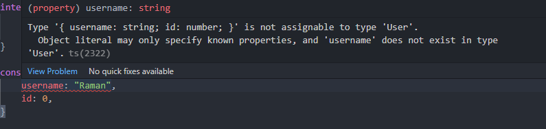
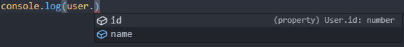

import Video from '@site/src/components/Video';

# Unit 9: Typing in TypeScript

## Welcome to Unit 9

This unit, we'll be learning about TypeScript a strict superset of JavaScript.
It has all of JavaScript's features, but also adds on TypeScript type's system. 

## Unit 9 Lecture Video

<Video src="https://www.youtube.com/embed/zQnBQ4tB3ZA" />
<Video src="https://www.youtube.com/embed/ahCwqrYpIuM" />


## TypeScript

### What is TypeScript?

TypeScript is a programming language, but it's not really its own programming language. 
It is built on JavaScript, and any syntactically correct JavaScript code will also run in TypeScript.
This means TypeScript can use most JavaScript libraries. 

Why do we use TypeScript if it's basically the same as JavaScript?
In JavaScript we can't catch errors without running our code.
With TypeScript, we can use give our variables types, and use static type checking.
This helps us discover bugs in our code much earlier, and fix them we need to run the code. 

### Typing

JavaScript provides pre-defined types:

- number
- boolean
- string
- void
- null
- undefined
- any

In TypeScript we can give the variables we define types. 

```tsx
let courseNumber: number = 133
console.log("Welcome to IN4MATX " + courseNumber + "!"); 
```

TypeScript will also infer types, if you assign the variable when creating it. 
Typing is optional, and you don't need to use them at all. 
You can do it all in plain JavaScript, and TypeScript will run the same.

```tsx
let courseNumber = 133
console.log("Welcome to IN4MATX " + courseNumber + "!"); 
```

If we are defining an array then we use square brackets after the type. 

```tsx
let array: number[] = [1, 2, 3, 4]
```

We can also specify types in function parameters and return values.

```tsx
function sum(a: number, b: number): number {
	return a + b;
}
```

### Objects and Types

In JavaScript we create objects as so. 
Often times this object will change by adding new fields, so TypeScript may assign the type `any`.

```tsx
const user = {
  name: "Raman",
  id: 0,
};
```

If the object doesn't change then, we can define its type ourselves. 
In TypeScript, we can help define the object's type with an `interface`

```tsx
interface User {
	name: string;
	id: number;
}
```

With the type defined, just as we did other primitive types, we can use it for our variables.

```tsx
const user: User = {
	name: "Raman",
	id: 1
}
```

If our object doesn't match, then TypeScript will tell us. 

```tsx
const user: User = {
    username: "Raman",
    id: 0,
}
// We will get this error:
// Type '{ username: string; id: number; }' is not assignable to type 'User'.
// Object literal may only specify known properties, and 'username' does not exist in type 'User'.ts(2322)
```

We can make our object more flexible by making it indexable. 
However, it does mean that all other fields that were specified are still required in the object. 

```tsx
interface User {
	name: string;
	id: number;
	[key: string]: any;
}

// This is now allowed
const user: User = {
		name: "Raman",
    username: "ramanxg",
    id: 0,
}
```

### Composing Types

We can also create our own types by combining other ones. 

**Unions**

Unions let us declare a type that can be multiple types.
We can use string or number literals to define a set of values a value can be, or we can specify that the variable can be different types. 

```tsx
type LockStates = "locked" | "unlocked";
type someString = string | string[];

// both are valid
let a: someString = "hello"
let b: someString = ["hello", "world", "!"]
```

**Generics**

Generics let us use variable in types. 
We can specify the type when defining the variable, so the type can be used more flexibly.

```tsx
interface MyType<Type> {
    field1: Type;
    field2: Type;
}

const x: MyType<string> = {
    field1: "hello",
    field2: "world"
}

const y: MyType<number> = {
    field1: 1,
    field2: 2
}
```

### Transpile

TypeScript is “transpiled” to JavaScript. 

```tsx
// hello.ts
let courseNumber: number = 133;
console.log('Hello, IN4MATX ' + courseNumber + '!');
```

We transpile with the typescript compiler using`tsc hello.ts`.

```tsx
// hello.js
let courseNumber = 133;
console.log('Hello, IN4MATX ' + courseNumber + '!');
```

We can install the typescript compiler with npm. 

```bash
npm install -g typescript
```

### tsconfig.json

This file will usually be in all of your TypeScript projects.
It lets us specify compiler options to help us transpile our project.

Here is an example `tsconfig.json`. 

```json
{
  "compilerOptions": {
    "module": "system",
    "noImplicitAny": true,
    "removeComments": true,
    "preserveConstEnums": true,
    "outFile": "../../built/local/tsc.js",
    "sourceMap": true
  },
  "include": ["src/**/*"],
  "exclude": ["node_modules", "**/*.spec.ts"]
}
```

There are so many ways to customize it, but usually for beginners, it's best to find similar projects to yours and utilize the same configuration. 

You can read more here: [Documentation - What is a tsconfig.json](https://www.typescriptlang.org/docs/handbook/tsconfig-json.html)

## TypeScript in VSCode

If you're using VSCode, when you are programming in a TypeScript file, it will do some very cool things to help you out. 

If one of the types don't match up. VSCode will highlight it for you. 



It can also provide suggestions if the object is typed.



There are lots of cool things VSCode can do for us to help us be more efficient when programming. 

[TypeScript Programming with Visual Studio Code](https://code.visualstudio.com/docs/languages/typescript)

## Assignment

We learned about TypeScript this unit, but for this topic, there will only be a quiz. 
For your real assignment, you will be polishing your personal websites, so you can show off to potential employers. 
Feel free to use whatever you want. (React, HTML and CSS, React in TypeScript ⁉️)

### Required Tasks

- Complete the [Quiz](https://forms.gle/pYTXoKTVwjXAVP5h8)
- Polish your Personal Website
    - Add an About Me
    - Add a Picture of yourself.
    - Add the Projects you have done.
    - Add any work experience, club involvement, leadership positions.
    - Add a link to download your resume
    - Add your socials (GitHub, LinkedIn).


:::info

 If you already have a personal website, you don’t need to make a new one. Just submit the URL to your old one.

:::


### Submission
Complete the [Google Form](https://forms.gle/pYTXoKTVwjXAVP5h8).
<iframe src="https://docs.google.com/forms/d/e/1FAIpQLSdDHF5fcsO2DmgmXJUHTczMAbcYzgqe18KJ7hGjs90K88FsGg/viewform?embedded=true" width="100%" height="3500" frameborder="0" marginheight="0" marginwidth="0">Loading…</iframe>

## External Resources
- [https://www.typescriptlang.org/docs/handbook/intro.html](https://www.typescriptlang.org/docs/handbook/intro.html)
- [https://www.freecodecamp.org/news/learn-typescript-beginners-guide/](https://www.freecodecamp.org/news/learn-typescript-beginners-guide/)
